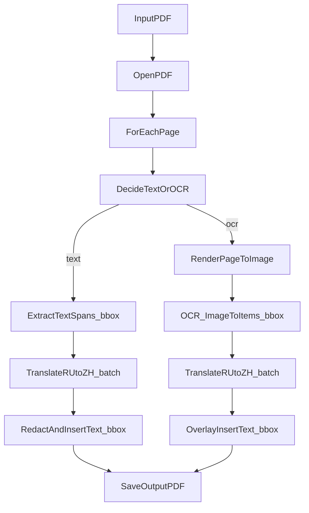

# Техническая спецификация: перевод PDF RU → ZH (отдельный модуль)

## 1. Название проекта

**PDF Translate RU→ZH** — утилита для перевода PDF-файлов с русского языка на китайский (упрощённый), с максимальным сохранением визуальной разметки исходного документа.

## 2. Цель и область применения

Разработать **отдельный модуль/папку** внутри репозитория, который:

- принимает PDF (текстовый, сканированный или смешанный);
- извлекает текст (из текстового слоя или через OCR);
- переводит русский текст на китайский (упрощённый);
- формирует новый PDF с **максимально похожей** разметкой (позиции/блоки текста по bbox);
- не влияет на существующие сценарии проекта (например, `main.py` из OCR→Excel MVP).

## 3. Принцип “ничего не сломать” (изоляция)

Обязательные гарантии:

- существующий сценарий `python main.py` должен работать **как раньше** и выдавать те же результаты;
- новый функционал реализуется **в отдельной папке** `pdf_translate/`;
- точки входа/CLI нового модуля не должны менять поведение существующих модулей;
- кэш/временные файлы PDF-перевода не должны засорять репозиторий (через `.gitignore`).

## 4. Входные данные

### 4.1 Формат

- Один PDF-файл (`.pdf`).

### 4.2 Типы PDF

- **Text PDF**: текст можно выделять/копировать (есть текстовый слой).
- **Scan PDF**: страницы — изображения/сканы, текст не выделяется.
- **Mixed PDF**: часть страниц текстовая, часть — сканы.

### 4.3 Ограничения (MVP)

- Повороты/сложные трансформации текста могут обрабатываться упрощённо.
- Сложные макеты (много колонок, таблицы в PDF) допускают частичную деградацию верстки при переводе.

## 5. Выходные данные

### 5.1 Формат результата

- Новый PDF-файл (`output.pdf`), содержащий переведённый текст.

### 5.2 Требования к визуальному соответствию

- максимально сохранить положение текста (bbox/блоки);
- для text-layer страниц предпочтительно “заменить” исходный текст;
- для OCR-страниц допустим “оверлей” (заливка фона + вставка перевода).

### 5.3 Шрифт (критично)

Требуется поддержка китайских иероглифов:

- если в PDF не встроен подходящий шрифт, некоторые просмотрщики будут показывать “квадратики”;
- модуль должен поддерживать явное указание `.ttf` через `PDF_FONT_PATH`.

Рекомендуемый шрифт: **Noto Sans SC** (`NotoSansSC-Regular.ttf`).

## 6. Архитектура решения (MVP)

### 6.1 Структура проекта

```text
project/
├── main.py                        # существующий OCR→Excel, не трогать
├── pdf_translate/
│   ├── __init__.py
│   ├── cli.py                     # точка входа CLI (python -m pdf_translate.cli)
│   ├── config.py                  # чтение .env и конфиг
│   ├── extract.py                 # извлечение текста и bbox из PDF (PyMuPDF)
│   ├── ocr.py                     # OCR рендеренных страниц (PaddleOCR)
│   ├── translate.py               # перевод через OpenAI + кэш
│   ├── render.py                  # вставка/замена текста в PDF по bbox
│   ├── assets/
│   │   └── fonts/                 # место под .ttf (опционально)
│   ├── cache/                     # кэш переводов (gitignored)
│   └── README.md
├── pyproject.toml
└── PDFSPEC.md
```

### 6.2 Поток данных



## 7. Зависимости

Минимально необходимые:

- `pymupdf` (PyMuPDF / `fitz`) — чтение/рендер/редактирование PDF
- `pillow` — работа с изображениями (конвертация pixmap→PNG)
- `openai` — перевод
- `paddleocr` — OCR для сканов

Примечание: допускается фиксирование зависимостей в `pyproject.toml` (как обычные) или как extras (если нужен максимально “чистый” базовый набор).

## 8. CLI (командный интерфейс)

### 8.1 Команда запуска

```bash
python -m pdf_translate.cli --in "input.pdf" --out "output_zh.pdf"
```

### 8.2 Аргументы

- `--in` (обязательный): путь к входному PDF
- `--out` (обязательный): путь к выходному PDF
- `--force-ocr` (опционально): принудительно OCR все страницы (игнорируя текстовый слой)
- `--dry-run` (опционально): выполнить извлечение/перевод, но **не сохранять** PDF

### 8.3 Код завершения

- `0`: успех (или нечего переводить, но без ошибок)
- `2`: ошибка конфигурации/входных данных (нет файла, нет API-ключа и т.д.)
- `>0`: прочие ошибки выполнения (по мере необходимости)

## 9. Конфигурация через `.env`

Файл `.env` в корне репозитория.

Обязательные:

- `OPENAI_API_KEY`

Рекомендуемые:

- `PDF_TRANSLATE_MODEL` (по умолчанию: `gpt-4.1-mini`)
- `PDF_FONT_PATH` (путь к `.ttf` со шрифтом CJK)
- `PDF_MIN_TEXT_CHARS_PER_PAGE` (порог “есть текстовый слой на странице”, по умолчанию ~40)
- `PDF_MAX_CHARS_PER_REQUEST` (батчинг переводов, по умолчанию ~6000)
- `PDF_OCR_LANGS` (например: `en,ru`; по умолчанию `en,ru`)

## 10. Извлечение текста (text-layer)

### 10.1 Единицы извлечения

MVP извлекает **span** (наименьшая единица с bbox и текстом) через PyMuPDF:

- `page.get_text("dict")` → `blocks/lines/spans`
- для каждого `span` берём:
  - `text`
  - `bbox` (x0,y0,x1,y1)
  - `page_index`

### 10.2 Фильтрация

- пропуск пустого текста после `.strip()`;
- пропуск слишком маленьких bbox (шум/артефакты).

### 10.3 Решение “text vs ocr” по страницам

Для каждой страницы считается суммарное число символов извлечённых span.

- если `chars >= PDF_MIN_TEXT_CHARS_PER_PAGE` → режим `text`
- иначе → режим `ocr`

Опция `--force-ocr` переопределяет режим на `ocr` для всех страниц.

## 11. OCR извлечение (scan-layer)

### 11.1 Рендер страницы в изображение

- PyMuPDF `page.get_pixmap(dpi=200)` (MVP, можно сделать параметром).

### 11.2 OCR и координаты

- PaddleOCR распознаёт полигон/бокс в координатах изображения;
- координаты маппятся в PDF points:
  - \(sx = page\_width\_pt / pix\_width\_px\)
  - \(sy = page\_height\_pt / pix\_height\_px\)
  - `pdf_x = page_x0 + px_x * sx`, аналогично по y
- итоговая сущность OCR: `{rect, text, score}`.

### 11.3 Дедупликация

MVP допускает простую дедупликацию по округлённым координатам bbox + тексту.

## 12. Перевод RU→ZH

### 12.1 Транспорт/модель

- OpenAI Responses API через официальный клиент `openai`.
- Модель задаётся `PDF_TRANSLATE_MODEL`.

### 12.2 Контракт перевода

Вход: список строк (span-строки или OCR-строки).  
Выход: список строк перевода той же длины.

### 12.3 Батчинг

- строки группируются в батчи по лимиту `PDF_MAX_CHARS_PER_REQUEST`;
- если батч-ответ неполный/невалидный, предусмотрен fallback:
  - попытка восстановить соответствие по id;
  - перевод “по одной строке” для пропусков.

### 12.4 Кэширование

- кэш переводов по хэшу текста (SHA-256);
- файл кэша: `pdf_translate/cache/ru_zh_cache.json`;
- кэш игнорируется гитом.

## 13. Рендеринг результата в PDF

### 13.1 Два режима нанесения текста

1) **redact** (для text-layer):
   - попытаться скрыть исходный текст через redaction (белая заливка);
   - вставить перевод в bbox.

2) **overlay** (для OCR):
   - поверх исходной страницы рисуется белый прямоугольник на bbox;
   - вставляется перевод в bbox.

### 13.2 Подбор размера шрифта

Вставка выполняется через `page.insert_textbox(rect, text, fontsize=...)`.

- стартовый размер: 12pt
- уменьшаем шагом ~0.8pt до минимума 5pt, пока текст не поместится (возврат `>=0`)

### 13.3 Шрифты

- если `PDF_FONT_PATH` задан и файл существует — использовать `fontfile=...`;
- иначе fallback на встроенный `helv` (но китайский может не отобразиться).

## 14. Ошибки и логирование

### 14.1 Логирование

- уровень `INFO` по умолчанию;
- обязательно логировать:
  - число страниц;
  - число извлечённых span;
  - режим для каждой страницы (text/ocr);
  - прогресс по страницам;
  - предупреждение о `PDF_FONT_PATH`, если не задан.

### 14.2 Обработка ошибок

- отсутствие входного файла → exit code `2`
- отсутствие `OPENAI_API_KEY` → exit code `2`
- ошибки OCR/перевода по одной странице не должны ломать весь документ (по возможности):
  - допускается пропустить проблемную страницу и продолжить
  - либо прервать выполнение, если это критично (оговаривается в реализации)

## 15. Критерии готовности (Definition of Done)

MVP считается выполненным, если:

- `python -m pdf_translate.cli --help` работает;
- текстовый PDF переводится и сохраняется без падений;
- mixed PDF переводится: text-страницы через extract+render, scan-страницы через OCR+render;
- выходной PDF открывается стандартными просмотрщиками;
- модуль лежит в `pdf_translate/` и не меняет поведение `main.py`;
- кэш переводов не попадает в git (через `.gitignore`).

## 16. Известные ограничения MVP

- перевод по span может дробить предложения (из-за мелких bbox) — это нормально для MVP;
- переносы/размеры текста в bbox могут отличаться (китайский иногда длиннее/короче);
- сложные таблицы/колонки могут выглядеть хуже после “подгонки” в bbox;
- для качественного результата на OCR-страницах может потребоваться тонкая настройка dpi/порогов PaddleOCR.

## 17. Роадмап (вне MVP)

- перевод не по span, а по блокам/параграфам с последующим распределением в bbox;
- авто-детект языка и пропуск уже-китайского/английского;
- интерактивный режим: сохранять промежуточный JSON и позволять ручную правку;
- режим “side-by-side” (RU и ZH вместе) или “двуязычный PDF”;
- профили OCR/рендера под разные типы сканов.

